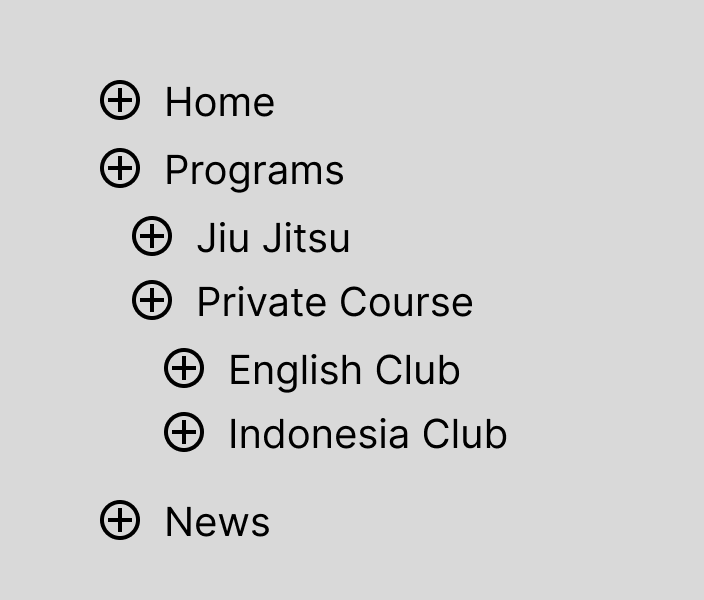

# Soal Ujian Web Developer Elisoft Technology

Silahkan kerjakan beberapa soal dibawah dan buat project menggunakan menggunakan Laravel Vue Js / React Js SPA (Single Page Aplication) dan gunakan Vue Router / React Router DOM.
> Jika selesai mengerjakan silahkan push ke github/gitlab Private dengan format test_webdev_elisoft_NamaAnda. Lalu undang email berikut
reiandika10@gmail.com, hrd@elisofttechnology.com. Terima kasih

#
1. Buatlah fitur authentikasi  login, logout menggunakan laravel JWT/Passport/Sactum dan berikan juga middleware jikasudah login titak bisa masuk ke halaman login, dan juga sebaliknya .

#
2. Buatlah fitur CRUD (Create, Read, Update, Delete) untuk entitas "Posts". Setiap post memiliki thumbnail, judul, konten (gunakan Rich Editor disarankan menggunakan Tinymce), status publish (Draft, Publish),dan tanggal publikasi.

#
3. Buatlah sebuah table menggunakan migration dengan skema table berikut :
```bash
id (uuid) Primary Key (Gunakan UUID untuk ID user)
name (varchar)
email (varchar)
password (varchar) HASH
status (enum) 1 Aktif 2 Nonaktif
created_at (timestamp)
updated_at (timestamp)
deleted_at (timestamp) (Gunakan Soft Delete)

```
Siapkan user dengan ***Database Seeder***
```
email : elisofttech@test.com
password : 12345678
```
#
4. Buatlah table data menggunakan vue good table (Jika menggunakan react bisa menggunakan React Table) server side pagination tiap page menampilkan 10 data yang didalamnya terdapat fitur searching server side dan juga filter server side (Status Publish, Start End date Tanggal Publikasi).

#
5. Implementasikan sistem notifikasi real-time menggunakan Laravel Echo dan Vue.js / React JS. Ketika ada perubahan pada entitas terkait (misalnya, post baru dibuat), sistem harus mengirimkan notifikasi ke user lain dan data user lain bisa terubah secara realtime tanpa perlu memuat ulang halaman.

#
6. Buatlah CRUD nested menu dengan output seperti gambar dibawah, jadi setiap nama menu bisa mempunyai child dan child juga bisa mempunyai child lagi (berulang). Icon **(+)** digunakan untuk menambah child di menu tersebut.


#
7. Buatlah route baru dengan path /list-profile-github dan buatlah list data seperti tampilan seperti dibawah ini dengan memanfaatkan api github **https://api.github.com/search/users** menampilkan foto profile github, username, follower, following, repositores dan buatlah fitur searching ketika inputan di input. Gunakan debounce selama 2 detik, untuk loadingnya bisa menggunakan skeleton.


#
8. Buatlah file dengan nama caseOne.js dan buatlah sebuah pola yang terdiri dari karakter-karakter yang tercetak pada fungsi caseOne. Pola tersebut akan membentuk sebuah matriks persegi dengan ukuran count x count.
Contoh:
Jika count memiliki nilai 4, maka pola yang terbentuk akan menjadi:
```
1 | _,_ | _,_ | _,_ |
_,_ | 2 | _,_ | _,_ |
_,_ | _,_ | 3 | _,_ |
_,_ | _,_ | _,_ | 4 |

```